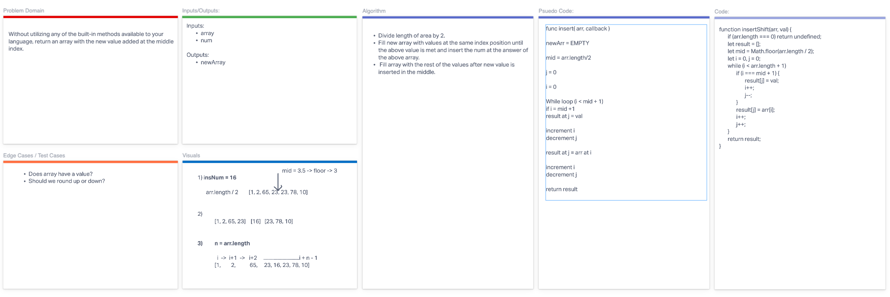

# Array Insert Shift

Without utilizing any of the built-in methods available to your language, return an array with the new value added at the middle index.

## Whiteboard Process

## Approach & Efficiency

Approached with the most efficient method we could find with the methods available.

## Collaborators: **Ben Choe** and **Dylan Ullrich**
