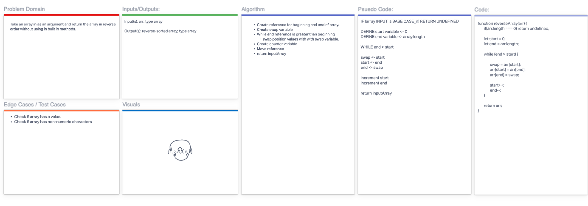

# Reverse an Array

Take an array in as an argument and return the array in reverse order without using in built in methods.

## Whiteboard Process

## Approach & Efficiency

We chose to use a while loop and implement a swap variable and two counter variables.

## Collaborators: **Ben Choe** and **Dylan Ullrich**
